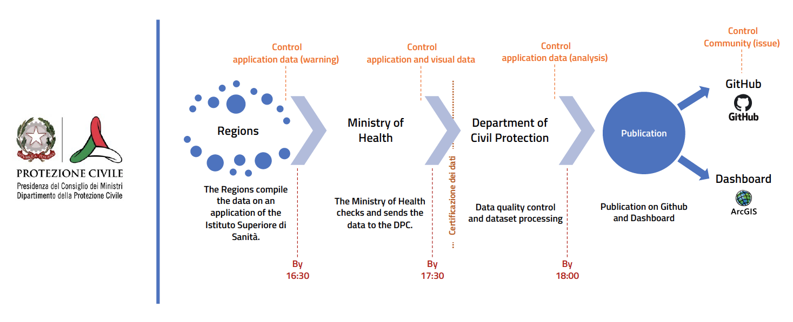

[Italiano](README.md) - [English](README_EN.md)

# Italian COVID-19 data

[](https://github.com/pcm-dpc/COVID-19/blob/master/LICENSE)
[](https://github.com/pcm-dpc/COVID-19/commits/master)

[Dipartimento della Protezione Civile - Emergenza Coronavirus: la risposta nazionale (IT)](http://www.protezionecivile.it/attivita-rischi/rischio-sanitario/emergenze/coronavirus)

On 31 January 2020, the Consiglio dei Ministri declared the emergency state for six months due to the infection from Coronavirus risk.
The coordination of the fighting against the national emergency is given in custody to the boss of Dipartimento della Protezione Civile, Angelo Borrelli.
The primary actions coordinated by him are done to help and assist the population eventually intersted by the infection, to improove the controls in the airportual and portual areas, in continuity with the urgent measures adopted by Ministero della Salute, to the returning of citzens who are in other risk Countries in Italy and to repatriation of strangers citzens in the homelands exposed to the risk.

To inform the citzens and give the reached datas, useful only to comunicate and informate, Dipartimento della Protezione Civile has elaborated a dashboard reachable to the URL http://arcg.is/C1unv (desktop version) and http://arcg.is/081a51 (mobile version) and give to everyone, under the licence CC-BY-4.0, the following infos updated dialy at 18.30 (after the press conference of the Boss Department):

- National evolution data
- json data
- Regional data
- Provincial data
- Summaries
- Areas
- Notes
- Contracts data DPC furnitures
- Metrics

## Warnings

[Warnings about the data about the evolution of the data about COVID-19 Italy (IT)](note/dpc-covid19-ita-note.md)

## Repository structure
```
COVID-19/
│
├── aree/
│   ├── geojson
│   │   ├── dpc-covid-19-ita-aree-comuni.geojson
│   │   ├── dpc-covid19-ita-aree.geojson
│   ├── shp
│   │   ├── dpc-covid19-ita-aree-comuni.dbf
│   │   ├── dpc-covid19-ita-aree-comuni.prj
│   │   ├── dpc-covid19-ita-aree-comuni.shp
│   │   ├── dpc-covid19-ita-aree-comuni.shx
│   │   ├── dpc-covid19-ita-aree.dbf
│   │   ├── dpc-covid19-ita-aree.prj
│   │   ├── dpc-covid19-ita-aree.shp
│   │   ├── dpc-covid19-ita-aree.shx
├── dati-andamento-nazionale/
│   ├── dpc-covid19-ita-andamento-nazionale-*.csv
│   ├── dpc-covid19-ita-andamento-nazionale-latest.csv
│   ├── dpc-covid19-ita-andamento-nazionale.csv
├── dati-contratti-dpc-forniture/
│   ├── dpc-covid19-dati-contratti-dpc-forniture.csv
│   ├── dpc-covid19-dati-pagamenti-contratti-dpc-forniture.csv
│   ├── dati-json
│   │   ├── dpc-covid19-dati-contratti-dpc-forniture.csv
│   │   ├── dpc-covid19-dati-pagamenti-contratti-dpc-forniture.csv
│   ├── file-atti-negoziali
│   │   ├── dpc-contratto-covid19-*.pdf
├── dati-json/
│   ├── dpc-covid19-ita-andamento-nazionale-latest.json
│   ├── dpc-covid19-ita-andamento-nazionale.json
│   ├── dpc-covid19-ita-note-en.json
│   ├── dpc-covid19-ita-note-it.json
│   ├── dpc-covid19-ita-province-latest.json
│   ├── dpc-covid19-ita-province.json
│   ├── dpc-covid19-ita-regioni-latest.json
│   ├── dpc-covid19-ita-regioni.json
├── dati-province/
│   ├── dpc-covid19-ita-province-*.csv
│   ├── dpc-covid19-ita-province-latest.csv
│   ├── dpc-covid19-ita-province.csv
├── dati-regioni/
│   ├── dpc-covid19-ita-regioni-*.csv
│   ├── dpc-covid19-ita-regioni-latest.csv
│   ├── dpc-covid19-ita-regioni.csv
├── metriche
│   ├── dpc-covid19-ita-metriche-dashboard-desktop.csv
│   ├── dpc-covid19-ita-metriche-dashboard-desktop.json
│   ├── dpc-covid19-ita-metriche-dashboard-mobile.csv
│   ├── dpc-covid19-ita-metriche-dashboard-mobile.json
├── note/
│   ├── dpc-covid19-ita-note-en.csv
│   ├── dpc-covid19-ita-note-it.csv
├── schede-riepilogative/
│   ├── province
│   │   ├── dpc-covid19-ita-scheda-province-*.pdf
│   ├── regioni
│   │   ├── dpc-covid19-ita-scheda-regioni-*.pdf
```

## Data updates

- Evoulution data about COVID-19 Italy: every days at 18:30
- DPC furnitures COVID-19 contracts data: every times that the contracts are stipulated



- Regions: by 4:30 pm fill in the data on an application of the Istituto Superiore di Sanità (application data control - warning)
- Ministry of Health: before 5.30 pm check and send the data to the DPC (application and visual data control - data certification)
- Department of Civil Protection: by 18:00 control of data quality, processing of datasets and publication on GitHub and ArcGIS Dashboard (application data control - analysis) 
- Civil society (Community): reporting through GitHub issues

## Data formats

- [Evoulution data about COVID-19 Italy (IT)](dati-andamento-covid19-italia.md)<br>
- [DPC furnitures COVID-19 contracts data (IT)](dati-contratti-dpc-covid19-fornitura.md)
- [Areas restricted and measures about COVID-19 (IT)](dati-aree-covid19.md)
- [Metrics (IT)](metriche.md)

## License

[CC-BY-4.0](https://creativecommons.org/licenses/by/4.0/deed.it) - [View license](https://github.com/pcm-dpc/COVID-19/blob/master/LICENSE)
